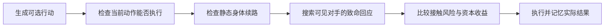

# 10月7日：高分段100局研习与机制重构

本轮从2026-10-07 19:29（北京时间）开始，时间上限两小时。学习样本固定为100场真实高分段排位，另外进行独立外部验证。没有安排自家新旧版本互打。本文中的“对手策略”是对可观察行为的概括，不是恢复了对手私有源码。

## 样本和证据

先截取前45名、当时均超过2000分的榜单，排除DEV。按排名顺序查20个高分队的最近对局，优先每队一组符合条件、已完成、双方均在名单内的排位；第二遍补充不重复组，取满20组后固定。每组5场全收，共100场、17张地图、25支队伍。

这是按排名覆盖的近期便利样本，不是整个天梯的随机样本。分数是取样时的分数，不能冒充比赛当时分数。组内5场相关，不能当100次完全独立试验。没有挑赢局，也没有用学习局充当候选验证局。

100份原始回放全部下载、以官方解码器重建完整身体和逐回合计分。100/100终局与平台胜者一致；99/100严格食物/付费账成立，M1341270含一个空动作，保持未知。资源来源单独按地图事件追踪，100份完成，能核对的99份与毛采集账一致。回放里的`suicide`只说明记录的动作类型，不能据此断言程序主动牺牲，也不能排除没有输出动作。

逐场链接、地图、两队、终局分数和失败分类见[100局清单](oct7-highrank100-matches.md)；原始回放哈希、导入ZIP来源、统计分母及逐队行为见[证据JSON](oct7-highrank100-evidence.json)。原始大文件保存在本地`test-results/oct7-highrank-study/`，未上传GitHub。

## 高分对局实际表现

| 观察 | 数据 | 能支持的结论 |
|---|---:|---|
| 全灭 / Queen / Longest决定胜负 | 46 / 28 / 26局 | 三种结局都必须评估，不能只保某一项 |
| 败方曾在完整回合末领先 | 95/100局 | 暂时领先不能替代终局检查 |
| Queen活到终局 | 81/200方 | 高分队也并非总能保住Queen |
| Queen死亡中的头碰撞 | 96/119次 | 应重点检验对手回应，而不只是静态续路 |
| 父体4节时分裂 | 34,906/53,807次，64.9% | 小体量裂殖是常见行为，不只是开局扩张 |
| 子体2节 | 39,370/53,807次，73.2% | 许多龙承担短生命周期的任务 |
| 2–3节龙的记录型suicide | 9,173/10,124次 | 不能只研究4–8节供体；但要另证交付效果 |
| 多步移动 | 129,363/2,033,854次，6.36% | 数量少但可能在关键接触时造成决定性损失 |

53,807次分裂分布为前100回合10,507次、100–299回合26,101次、300回合以后19,759次。后期仍有大量补充人口；这些是原始事件数，各阶段长度、存活队伍和龙数不同，不能直接比较生产效率。

165,333次实际吃到珍珠的事件中，87,908来自自然生成，65,529来自己方遗骸，11,896来自敌方遗骸。同一批身体可能被反复回收，所以“采集很多”不等于“创造很多新长度”。完整资本关系仍是：初始长度 + 实际净增长 − 死亡移除长度 = 终局保留长度；分裂本身只重新分配身体。

### 两个可复查的例子

**M1341780，Schooltime。** 双方Queen都是3节，两条Queen各只访问4个不同头部位置，终局最长龙却是3对67。胜方284次分裂、551颗自然珍珠、447颗己方回收珍珠，最后19条龙共248节。保护Queen的小循环可以有用，但工兵仍要在外面创造并保留优势；不能让所有龙都停在同一种保命循环里。

**M1339335，Slithery Fight。** WeHaveQuizzes的Queen终局90节。其完整账为初始25 + 实际采集100 − 分裂转出35 − 付费0 = 90；100颗采集中94颗来自己方记录型suicide遗骸。整队921次分裂、毛采集2688、付费113、净增长2575，但死亡移除2390节，终局保留232节。这里有可见的集中资源过程，却不能据此认定“牺牲越多越好”。

跨图也有差异：WeHaveQuizzes样本10场中，Queen吃到317颗，其中271来自己方遗骸；horse样本10场中Queen吃到137颗，其中89来自己方遗骸，但没有记录型suicide小供体事件。遗骸回收不等于只能通过同一种牺牲指令实现。

### 三种值得区分的可观察形态

| 样本队伍（均10场） | 平均终局龙数 | 平均终局Longest | 平均终局Queen | 本轮观察启发 |
|---|---:|---:|---:|---|
| aAah | 37.1 | 6.2 | 1.7 | 人口多与单龙长是不同目标 |
| WeHaveQuizzes | 6.0 | 47.9 | 25.6 | 少量终局存活者也能承载大量计分长度 |
| horse | 26.0 | 37.7 | 9.8 | 人口和长龙并非必然互斥；样本没有记录型suicide动作 |

这些是不同对手、地图和种子下的描述，包含全灭场次的零值，不能当作受控强度排名，也不能宣称恢复了三队的决策代码。重构应分别表达“创造机会”“集中长度”“保住终局资产”，而不是给三队贴标签后写死针对某张图的规则。

## 本轮代码

人口、交付、对手回应三项机制各自从`generalist-evidence-v1`独立派生；对手回应另保留一次优先级修正，合计四份冻结快照。这个实验底座承接V5，**不是线上v66**；不能把底座差异造成的表现全归到一个新增功能。

### 1. 人口生命周期：`colony-lifecycle-v1`

把“升成储备龙后永久不退、达到固定人口就停”的规则，改成短期局部主长龙身份与边际繁殖机会。4节工兵只有在父子身体完整、子体有出口和续路、局部有资源/探索机会且接触风险低时才分裂。当前局部长龙保长度，看到更强队友后可退出该身份；旧信息会过期。Queen和最后存活者仍受保护。

**结果否定直接采用。** 主外部组88场84胜4负，KGTS组44场39胜5负；原V5外部记录分别87胜1负、42胜2负，旧记录不重复计入新增场次。主组46组共同有效的配对中，平均终局龙数+20.22、净增长+211.98，但死亡移除+294.17、保留长度−82.20、最长龙−26.74。KGTS44组也出现净增长+252.11、死亡移除+331.07、保留长度−78.95、最长龙−23.39。

这次确实更会扩张，也确实没有把新增收入留住。新增长龙的保护和交接不足，不能靠继续提高分裂奖励解决。

### 2. 小供体交付：`capital-transfer-v1`

把供体范围聚焦到完整可见的2–3节小龙。Queen先模拟自己的当前动作，再对下一回合相邻的供体发出一次交付提议；供体重新检查当前Queen、消息时效、己方存活数、完整身体及附近竞争。满足条件才通过撞自己的已知颈部释放遗骸。Queen只对真实看到的珍珠执行收取，并检查后续路线；不是收到消息就假定已经有食物。

Sonar没有发送者认证，因此只是提议，不能越过物理检查。每次交付损失整队部分总长度，是把分散长度换成优先计分资产；不是免费增长。方案不包含远距离召集、排队或护送。

真实引擎两回合构造检查成功：2节供体释放，Queen收到1颗，从3长到4。主外部88场全部完成，47场对手没有运行错误；3场实际发生交付，共3次释放、Queen最终收到6颗，其中3颗在紧接的下一回合收到。共同有效配对的Queen平均仅+0.043节，作用很稀疏。

上传为平台v20 / submission19558后，仅做Goated全17图非排位发现测试，确认版本绑定后已恢复原v14。结果0胜17负，5场败于Queen、10场全灭、2场败于Longest；Queen终局存活4/17，最长龙均值3.65。**17场交付提议与实际交付均为0**。此前独立原版v14全17图为4胜13负，Queen存活2/17、最长龙均值9.76。种子不同、对手私有版本未核实，不能作严格因果配对，但候选整体显然没有获得采用证据。

平台源ZIP上传前已逐文件核对冻结哈希，UI确认v20与提交号。下载服务器源码时Edge显示`ERR_BLOCKED_BY_CLIENT`，没有绕过；因此证据是本地ZIP→上传操作→提交UI绑定，不冒充已重新下载核验服务器字节。

### 3. 对手回应搜索：`adversarial-reply-v1`

这轮线上候选13次Queen死亡中11次为头碰撞，多个死亡前动作仍标着静态8步续路。新增一层有界对手回应搜索：先把Queen走完后的身体放到棋盘上，再尝试完整可见敌龙的合法冲刺，逐步检查自身身体、其他身体、已经被Queen吃掉的食物和付费预算。若能给出一条撞到Queen头部的具体路线，降低这个候选的即时存活优先级。

这是单次对手回应的条件性反例搜索，不是完整多人Minimax，也不证明“没找到路线就安全”。敌身不完整、未知传送门、视野外路径或预算耗尽保留未知；不猜隐藏状态。每个候选最多320次展开、最多10步，仅对Queen启用。静态续路、动作合法性和对手回应分别记录，避免把一种证据当另一种。

构造检查覆盖三步付费冲撞、2节龙付费不足、途中吃食物后可支付、食物已被Queen吃掉、颈部阻挡和不完整身体。官方引擎固定回应另验证了“3节可两步撞头、2节无食物不可、2节先吃食物可以”的物理顺序。

`adversarial-reply-v2`修正一处优先级冲突：已经找到致命回应的免费动作，不能凭“少花长度”就把尚未找到致命回应的付费动作提前排除。构造检查同时证明，若没有这种冲突，原本的资本节约筛选仍然有效。v1冻结源码保留，用于分清机制和后续修正；不是每次编辑都创建线上版本。

新搜索有明确的观察边界。100局中96次Queen头碰撞，攻击者在Queen上次行动时全身可见42次、身体部分可见28次、头部在视野外13次、尚未出生5次；另有友军发起2次、Queen自己发起6次。这里的“全身可见”只是新搜索可能适用的上界，不证明这42次都会被识别或防住。线上v20的11次头碰撞中，全身可见4次、部分可见1次、头部在视野外5次、Queen自己发起1次。

原来的BFS仍用于在已知地图上找资源方向。新增搜索则试走**对手的整个本回合动作序列**，二者解决的问题不同。扩大BFS范围并不会自动获得视野外敌人的当前位置。

## 实验中断与恢复

D盘写满导致三场在保存回放时失败：交付版KGTS一场、回应v1主组一场、回应v1 KGTS一场。没有把它们当作胜场。对本项目实验目录启用NTFS压缩，8.94GB逻辑数据压缩为3.57GB物理占用，未删除证据或改变文件内容。

原失败记录和部分回放保留。恢复实验使用单独目录、相同源码/二进制/地图/种子/9000万点门槛；已完成有效场次复用且只计一次，只补跑写盘失败和未执行的场次。恢复脚本明确拒绝通过这条路径绕过机器人运行错误或预算失败。

## 最终检查与场次

本轮新增480场完整本地外部比赛：人口132、小供体132、回应v1共128（主组88、KGTS40）、回应v2主组88。恢复复用的旧完成记录只计一次；前轮132场V5参照不计新增。另有3次写盘失败和1次因本轮时限中断的尝试，全部保留，不计完整比赛。

| 候选 | 主外部组完整胜–负 | 主组无对手运行错误胜–负 | KGTS完整胜–负 | 线上Goated胜–负 |
|---|---:|---:|---:|---:|
| 人口生命周期 | 84–4 | 51–2（53场） | 39–5（44/44） | 未上传 |
| 小供体交付 | 88–0 | 47–0（47场） | 42–2（44/44） | 0–17 |
| 回应搜索v1 | 87–1 | 46–1（47场） | 38–2（40/44，未完成） | 未上传 |
| 回应搜索v2 | 87–1 | 46–1（47场） | 未安排 | 2–14 |

回应v1的KGTS只完成40/44，配对Queen均值差-0.725、Longest差+0.900、保留长度差+0.650节。该部分结果不冒充完整44场；4场缺结果，其中UNSW A侧保留中断记录，其余未执行。

全部已完成候选比赛无己方运行错误或9000万点预算余量失败。部分主外部比赛对手运行错误，保留官方输赢但从机制有效配对中排除。5项Python检查、4组官方WASM C++构造检查通过；另有供体交付及3种对手付费回应的真实引擎物理检查。Git归档保持40份冻结源码逐字节一致；官方helper原有空白保持原样。

## 当前判断

### 最终实战验证

回应搜索修正版上传为平台v21 / submission19600，绑定Goated非排位16图后恢复v14。16图在发起前确定为标准图单前16项，未选weakhold；不是看输赢后删除地图。连同100局高分学习、原版17场和交付版17场，本轮完整审计150场平台真实对局，其中学习集100场，验证集50场。

| 同一组16张图，对手Goated | 胜–负 | Queen存活 | 平均终局Queen | 平均终局Longest | 净增长合计 | 保留长度合计 |
|---|---:|---:|---:|---:|---:|---:|
| 原版v14 | 4–12 | 2/16 | 1.063 | 10.375 | 7,618 | 1,001 |
| 小供体v20 | 0–16 | 4/16 | 1.188 | 3.875 | 2,297 | 207 |
| 回应搜索v21 | 2–14 | 4/16 | 1.813 | 12.438 | 2,492 | 374 |

不同种子、对手私有版本未核实，而且Goated已用于发现问题，因此这是重复对手的发现验证，不是盲测或严格因果估计。原版17图中weakhold负场仍保留在全部数据中。v21的14场失败为9场全灭、5场Queen；12次Queen死亡中10次头碰撞，攻击者此前全身可见5次、部分可见2次、头部视野外3次。完整可见不意味着身体可重建，也不意味着存在可选安全动作；本轮没有逐个证明这5次搜索失败的内部原因，不能说都已修复。

**不采用任何候选替换正式版本。** v20、v21保留Ready供复查；正式Active已核实为v14（归档v66 / submission15719），当时页面显示1534分。非排位发现测试不等于天梯涨分，分数不作为本轮算法收益证据。

回应v1与v2主外部组各88场，均87胜1负、47场机制有效；共同有效配对的Queen均值+2.149节，中位数0，只有2场提高、2场下降、43场不变。局部均值改善不能推出广泛优势。v2未补做KGTS组，保留这个覆盖缺口，不能借用v1结果作为v2的通过证据。

小供体完整132场有4次释放，总供体长度12节，Queen实际收取8颗，紧接下一回合收到4颗。KGTS44场42胜2负。物理机制成立，触发率和对强敌效用没有成立；8颗交付不是相对对照的8节净收益。

### 下一步应验证的机制

1. **把存活资产交接做完整。** 人口实验已有明确反证：增长提高而死亡损失涨得更快。下一轮应研究主长龙身份交接、危险区撤离与资源归属，而非继续上调人口目标。
2. **把接触预警与局部回应搜索分开。** 搜索只对看见且能重建的敌龙有效；视野边界的预警、队友信息的新鲜度和Queen退出路线需独立检验。没有证据时保持未知，不能把未知写成安全。
3. **先改善强外部对手上的适用范围。** 公开简化对手上接近全胜，线上仍大量全灭，说明该基准不足以决定采用。继续用冻结外部对手、整场资本账和终局结果，原176场独立种子留出不动。

学习高分队要学习“资源如何变成终局优势”的过程，而不只是分裂次数。现有公开对手的动作较简单，得分接近饱和；必须把成熟线上对手作为另一层验证。Queen静态能绕圈、工兵多、毛采集高，任何一个单独成立，都不足以说明能打高分段。

没有改动或降低既有9000万点预算余量门槛。旧独立种子176场留出保持未开启；发现集反复使用不再具有盲测含义。本轮不以分数波动冒充算法收益。

规则依据：[死亡与遗骸](https://game.battlecode.au/docs/death)、[分裂](https://game.battlecode.au/docs/splitting)、[Sonar](https://game.battlecode.au/docs/sonar)。统计来自本轮保存的回放和完整引擎记录。
