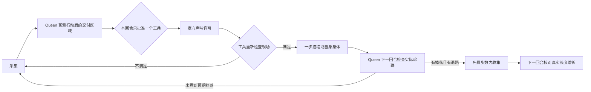

# v5：拥堵控制、近距离交付与 Queen 收集

## 当前状态

这套系统已经实现为 `bot/cooperation.hpp`，不是只写了设想。默认配置为
`Config{false, false, true}`：保留 v4 的普通行动，只开启有严格现场检查的就近交付。
拥堵控制、主动靠近两个模块可单独开启，现阶段不默认开启，原因见后面的对照结果。
未上传比赛平台，也未推送本轮开发代码。Sprint 原版远程标签保持不变；v4 快照在 `opponents/v4`。

本轮确定实现的边界是“已经在附近的小工兵，是否值得交付给 Queen”。
不是全图物流系统，也没有宣称找到了安全无限绕圈的方法。

## 一、设计目标与优先级

1. Queen 不充当牺牲者；不能为了收货走入已知死路。
2. 默认不牺牲被识别为后备长龙的工兵，且交付前全队至少有 4 条龙。
3. 判断成功以 Queen **实际增长**为准，发出许可、工兵死亡、地上出现珍珠都只是中间步骤。
4. 不能通过“数量超过阈值就自杀”清场。拥堵先停止普通扩张，再让路；交付必须另过全部检查。
5. 默认情况下，没有交付机会时回到 v4 决策。未证实有效的权重不强行变成新基线。

## 二、状态与退出条件

| 状态 | 谁进入 | 行为 | 退出条件 |
| --- | --- | --- | --- |
| Harvest：采集 | 普通龙 | 原有移动、采集、分裂策略 | 拥堵或存在合适交付机会 |
| Yield：让路 | 工兵，实验开关 | 限制普通扩张，在安全等级相同的路中远离友方头部 | 连续 3 回合低拥堵 |
| Approach：靠近 | 局部选出的工兵，实验开关 | 在可见 Queen 附近保持约两格间距；暂不分裂 | 6 回合超时、Queen 消失、敌人出现或候选优先级改变 |
| AwaitDrop：等待掉落 | Queen | 完成当回合普通移动后，向一个工兵发许可；不凭许可穿过身体 | 下一回合核对掉落，失败则取消 |
| Release：交付 | 获准工兵 | 重新验证现场，用一步撞墙/自身身体释放珍珠 | 工兵死亡，不再有后续消息 |
| Collect：收集 | Queen | 只沿当前可见、重新模拟过的路线吃实际珍珠 | 收完、三回合过期、被阻挡或现场不再安静 |



## 三、拥堵模块：先减少制造拥堵，再调整移动

在当前视野内，沿普通边搜索与自己连通的地形区域。统计区域格数、友方占用格数和友方头数。
墙另一边的龙不参与这一区域的统计；未知区域和传送门外区域不假装已知。

- 进入拥堵：友方头数至少 4，或友方身体占用至少 35%。
- 退出拥堵：友方头数至多 2，且占用低于 25%，连续满足 3 回合。
- 35%/25% 分开，使状态不会在一个临界值附近反复切换。
- 拥堵时只关闭**普通扩张**；应急分裂仍允许。工兵移动对附近友方头部加距离惩罚。
- 惩罚仅在原有退路等级比较后发挥作用，不允许用“让路”奖励覆盖眼前撞墙/撞身体检查。

这些阈值是待调试的启发式，不是数学安全界限。当前普通地图结果未证明该模块提高胜率。

## 四、谁可以交付：全部条件都要成立

1. 自己不是 Queen，且不是本进程已识别的后备长龙。
2. 长度在 4–8，全队至少 4 条龙；第 498 回合起不再启动新交付（回合从 0 计）。
3. 收到**本回合、指向自己 ID**的唯一许可；重复或冲突的许可直接放弃。
4. 当前能看到同队 Queen；双方身体都能完整还原，自己的身体还必须与已有记忆一致。
5. 身体还原不能跨未知区域、传送门或有歧义的身体链。
6. 当前视野中没有敌方身体/头部，也没有 Queen 和交付者以外的友方头部。
7. 存在确定的一步撞墙或撞自身身体动作。**不撞 Queen 或其他龙，不发送非法动作，不赌传送门死亡。**
8. 模拟工兵移除后，Queen 能在最多三步、且不超过免费步数的路径上吃到至少两颗预期掉落；
   对较多掉落，至少覆盖一半、向上取整。
9. 模拟吃完后的身体增长，并找到至少六步的可见续路。搜不到或证据不够就拒绝。
10. 与“工兵不死，Queen 直接吃现有食物”的同类短期搜索比较；没有额外收益则拒绝。

第 10 条只衡量接下来几步的机会成本，没有完整计算工兵未来的长期采集收益。
后备角色也只是 v4 的局部角色识别，并非全队一致选举。

## 五、为什么一定要由 Queen 先发许可

官方按 ID 从小到大行动，Queen 是 0/1，工兵更晚行动。每个动作执行完才发声呐；
如果发送者死了，声呐会被丢弃。因此不能设计成“我先死，再通知你来吃”。

Queen 先模拟自己本回合移动结束后的身体，再判断这个位置是否适合接货。
只沿确定能先撞到该工兵的普通直线发一个声呐；不用反方向尾部发射和跨门声呐。
本地只保留一个待交付工兵，许可间隔至少 8 回合，待收集记录最多保留 3 回合。

许可使用 32 位编码：6 位格式标识、1 位 Queen ID、9 位回合号、16 位工兵 ID。
超过 65535 的工兵 ID 不参与这种交付。第一回合接收方尚未升级到协议 3，
64 位许可曾被引擎过滤；32 位格式已通过首回合官方引擎验证。

**声呐没有可信的发送者信息，格式标识不等于身份认证。**
因此消息不提供可信长度/位置，工兵必须从视野重建现场、重新评估交付。
这仍不是抵抗恶意伪造的密码学协议：看不见的敌人可能发送同格式消息；
对专门针对本协议的对手，接收方无法仅凭声呐证明 Queen 确实批准过。

## 六、掉落和增长必须分别核实

掉落位置按工兵身体第 0、2、4……节计算。死亡发生前不走中间步骤，所以不会弄错掉落地点。
Queen 下一回合先确认交付者没有仍然站在视野里，并看到完整预期珍珠图案，才进入收集。
每一步仍检查当时的实际身体和珍珠；队友占位、敌人进入、掉落消失都会导致取消或重新选普通行动。

收集动作完成后，再下一回合比较 Queen 的实际长度变化与模拟吃到的总数。
只有两者一致、且 Queen 活着继续运行，才记录 `FEED_RECEIPT`。
这比仅记录 `FEED_RELEASE` 更接近真正目标。

回放标记分别为：`FEED_GRANT`（许可）、`FEED_RELEASE`（工兵交付）、
`FEED_PICKUP`（Queen 执行收集）、`FEED_RECEIPT`（下一回合核对增长）。
批量工具另记 `intentional_self_collisions`，不把已标记的交付自撞和普通导航自撞混为一谈。

## 七、实现入口

| 函数 | 职责 |
| --- | --- |
| `density` / `update_density` | 拥堵测量和进入/退出状态 |
| `steering` | 让路与局部靠近的移动偏好 |
| `complete_body` | 验证看到的是完整身体，而非可见的一小截 |
| `project` | 模拟 Queen 当前动作后的局面 |
| `delivery_route` / `pickup_route` | 掉落、身体增长、免费步数、退路和替代食物收益 |
| `pack` / `unpack` / `sonar_to` | 单个交付许可与传递路径 |
| `choose_turn` | 状态、许可、拒绝、收集和增长核对 |

`Controller scene = ct` 是复制一份局面来做假设，不会改变真实比赛。
`std::optional` 表示“可能没有许可/方向”；`enum class Mode` 表示有明确名字的有限状态。
先读 `choose_turn` 的 Queen/工兵两个分支，再深入路线搜索。

## 八、验证与当前判断

普通地图：Default、Portals、Dilemma、Queen Of Spades、Slithery Fight，各交换双方位置。
对手为原 v4，官方 `unswbc==1.2.3` 沙箱。

| 配置 | 种子 | 胜/负 | 真实交付次数 |
| --- | --- | --- | --- |
| 全开初版 | 71 | 3/7 | 0 |
| 关闭主动靠近，保留拥堵和交付 | 71 | 4/6 | 0 |
| 仅就近交付 | 71 | 5/5 | 0 |

初版使用了 64 位许可，后续已修复；这批样本中连许可也没有触发，不能把输赢归因于喂食。
这些小样本不证明统计上的优劣，但不支持把拥堵权重和主动靠近提升为默认策略。
正式冻结后的新种子结果单独保存在 `tests/fixtures/cooperation-v5-results.json`。

最终版本用新种子 103 再跑相同五图、双方换边：5 胜 5 负，真实交付 0 次。
无无效行动或超预算，最高 11.2M points。该成绩与未触发交付时的 v4 行为一致，不能解读为提升。
最终快照在 `opponents/v5-experimental`，源码哈希
`5da786622bbe483a9b4f0ea87f95b5168f014cfeec63ed873a6a045ae3792f36`；
对照、集成测试和 `dist/queen-v5-cooperation-experimental.zip` 已核对为相同源码。

另有一个专门构造的官方引擎集成场景：Queen 长度 9，附近工兵长度 4。
双方运行真实 bot，经真实声呐、真实死亡掉落和真实移动，Queen 确实增长至 11。
该场景没有用单元测试的局面复制冒充引擎执行。结果保存在 `tests/fixtures/cooperation-engine.json`。
它证明机制可以运作，**不证明普通地图中经常出现这种机会，也不证明提高胜率**。

测试命令：

```powershell
g++ -std=c++20 -O2 -Wall -Wextra -pedantic tests/cooperation_test.cpp -o tests/cooperation_test.exe
.\tests\cooperation_test.exe
.\.venv\Scripts\python.exe tests/cooperation_engine.py
.\.venv\Scripts\python.exe tools/compare.py --candidate bot --opponent opponents/v4 --maps default portals dilemma queen_of_spades slithery_fight --seeds 103 --name cooperation-v5-check --replays
```

场景测试覆盖：拥堵滞后退出、身体缺失、掉落奇偶位置、死路、现成食物机会成本、
首回合许可格式、过期/重复许可、敌人/第三方队友介入、后备保护、低单位数、终局禁发、
未实际交付时取消、真实增长核对，以及关闭模块后回到原有行为。

## 九、仍然不能保证的部分

- 没看到敌人，不代表全图没有敌人；未知区域的敌方冲刺或传送门攻击可能打断交付。
- 六步续路是静态其他单位的短期模型，不是对真实未来的证明。
- 严格要求双方完整身体可见，导致长 Queen、狭窄视野、传送门附近经常无法交付。
- 暂时没有全图集合点、可靠寻址、带身份认证的通信或长期工兵收益估计。
- 当前系统不主动证明和执行无限安全环路；Queen 仍使用滚动避障和短期身体模拟。

下一次扩展应先提高交付机会的出现率并记录失败原因，再考虑放宽可见性要求。
不能为了让计数变大而删除现场检查，也不能把工兵死亡数当作资源交付成功数。

规则依据：
[执行顺序](https://game.battlecode.au/docs/execution-order)、
[声呐](https://game.battlecode.au/docs/sonar)、
[死亡掉落](https://game.battlecode.au/docs/death)、
[协议升级](https://game.battlecode.au/docs/protocol-upgrade)。
